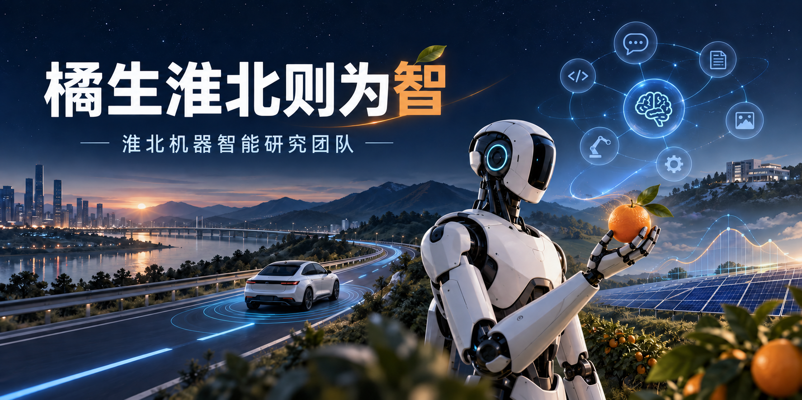
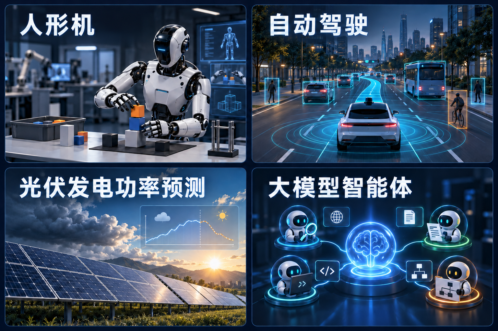

<h1>淮北机器智能研究团队</h1>

<h2>橘生淮北则为智</h2>

探索机器智能，让感知连接行动，让预测服务现实。

<strong>人形机 · 自动驾驶 · 光伏发电功率预测 · 大模型智能体</strong>

  <a href="#关于我们">团队介绍</a> ·
  <a href="#研究方向">研究方向</a> ·
  <a href="#研究理念">研究理念</a> ·
  <a href="#交流与合作">交流合作</a>

---

## 关于我们

淮北机器智能研究团队围绕人形机、自动驾驶、光伏发电功率预测与大模型智能体开展研究，探索智能技术在物理世界、交通场景、能源系统和复杂任务中的应用。

从理解环境到自主行动，从预测变化到辅助决策，我们关注机器如何在真实场景中学习、推理与协作。我们希望将算法探索与实际问题相连接，以可验证的研究推动可靠、实用的智能系统。

**“橘生淮北则为智”** 是我们的口号，也寄托着团队扎根实践、持续探索的愿景：让想法在问题中生根，让智能在应用中成长。

## 研究方向

从具身行动到自主决策，从能源预测到智能协作，我们围绕四个方向探索机器智能的能力与应用。

### 人形机｜让智能走进物理世界

面向复杂环境中的交互与作业任务，研究人形机的环境感知、具身决策与运动控制，探索从理解指令到完成动作的完整过程。

- **感知与理解：** 多模态环境感知、场景理解与任务指令解析。
- **决策与执行：** 具身智能、技能学习、全身运动控制与灵巧操作。
- **训练与验证：** 仿真训练、从仿真到现实的迁移，以及真实任务中的性能评估。

### 自动驾驶｜理解道路，规划行动

围绕动态交通场景，研究车辆如何感知周围环境、预测交通参与者行为，并形成合理的驾驶决策，关注复杂场景中的适应能力与系统可靠性。

- **环境感知：** 多传感器信息融合、道路场景理解与目标识别。
- **预测与规划：** 交通参与者行为预测、交互决策与轨迹规划。
- **系统评估：** 场景建模、闭环仿真与复杂工况下的鲁棒性验证。

### 光伏发电功率预测｜用数据理解能源波动

面向光伏出力的波动性与不确定性，结合历史功率、气象信息和时间序列建模，研究不同时间尺度的功率预测，为能源调度与运行决策提供参考。

- **多源建模：** 气象数据与历史功率融合、时序特征提取和数据质量分析。
- **预测方法：** 超短期与短期功率预测、概率预测及不确定性量化。
- **场景适应：** 跨场站泛化、天气变化适应与预测结果的应用评估。

### 大模型智能体｜从语言理解到任务执行

以大模型的理解与推理能力为基础，研究能够规划任务、调用工具、利用记忆并与环境交互的智能体，探索复杂任务中的自主执行与协同能力。

- **任务规划：** 目标理解、任务分解、推理与执行反馈。
- **工具与知识：** 工具调用、检索增强、知识利用与记忆管理。
- **协作与评估：** 多智能体协作、任务完成度评估与执行可靠性分析。

## 研究理念

四个研究方向共同指向一个问题：**如何让机器在变化的环境中，作出有依据、可检验的判断与行动？**

我们以真实问题牵引研究，将数据、模型、系统与场景连接起来：

1. **从问题出发。** 明确应用需求与研究边界，让技术探索回应具体挑战。
2. **用实验检验。** 重视数据质量、对照实验和可复现评估，让结论有据可循。
3. **在系统中验证。** 关注模型与感知、控制、工具及业务流程的衔接，评估实际表现。
4. **在交流中成长。** 鼓励跨方向讨论与合作，让不同领域的经验相互启发。

## 交流与合作

欢迎关注机器智能的同学、研究者与合作伙伴，与我们交流研究想法、探讨技术问题、共建应用场景。

- **学术交流：** 围绕具身智能、自动驾驶、能源预测与大模型智能体分享问题、方法与实验经验。
- **联合研究：** 从共同关注的课题出发，探索数据、算法和系统层面的合作。
- **场景共建：** 结合具体需求，讨论技术验证与应用探索的机会。

关注 [团队 GitHub](https://github.com/hbjqzn)，了解后续公开内容与项目动态。

---

<strong>橘生淮北则为智</strong>

以探索为起点，以实证为方法，以应用为目标。

